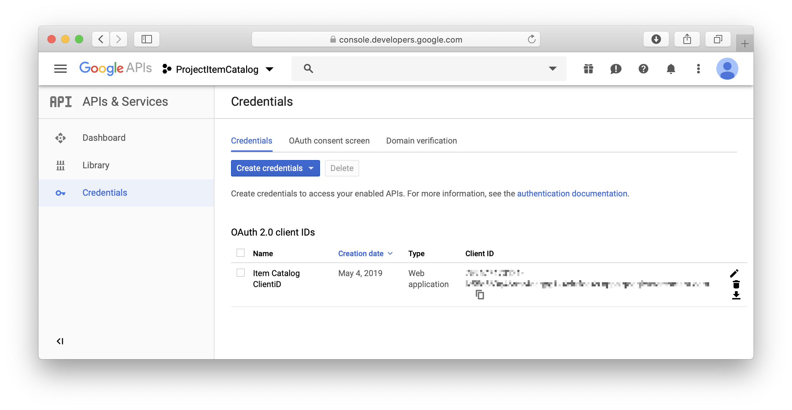
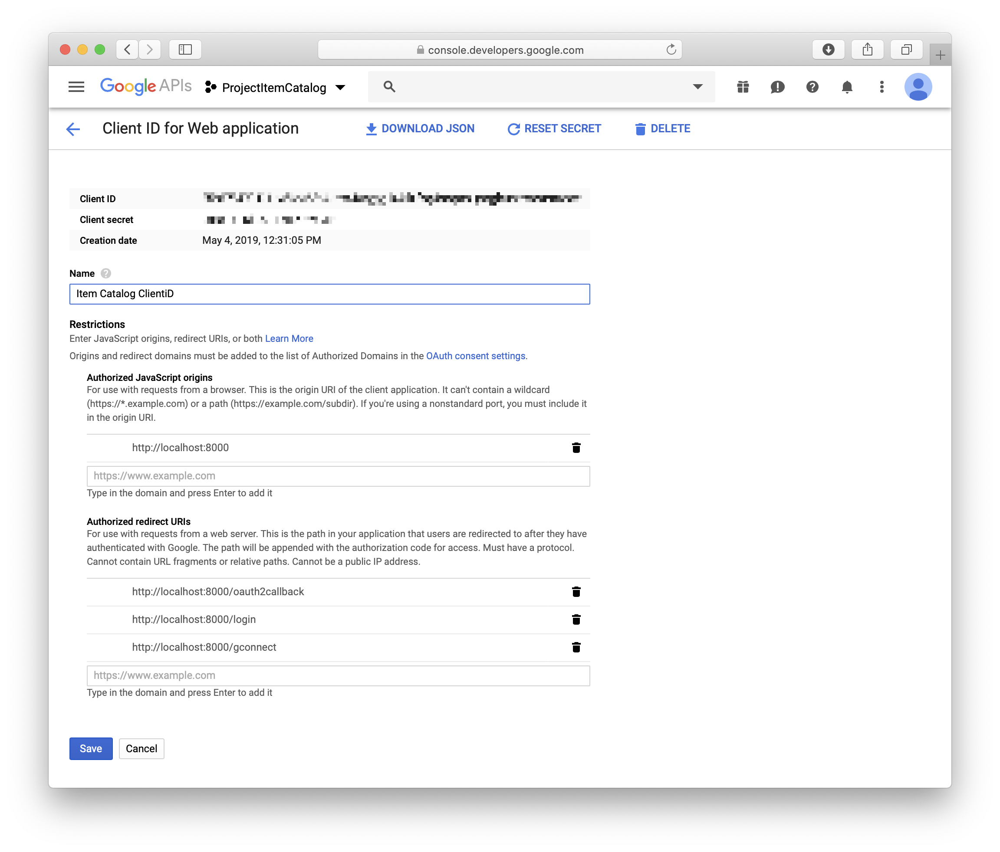
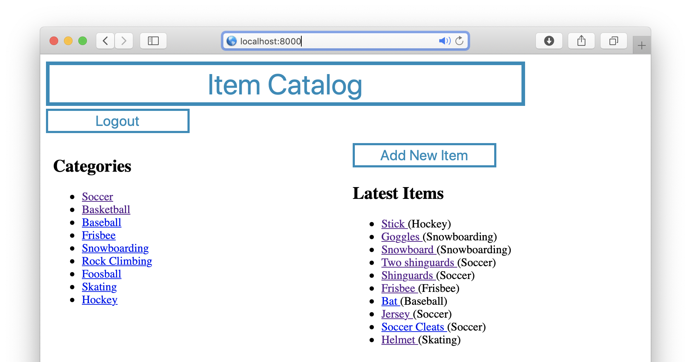
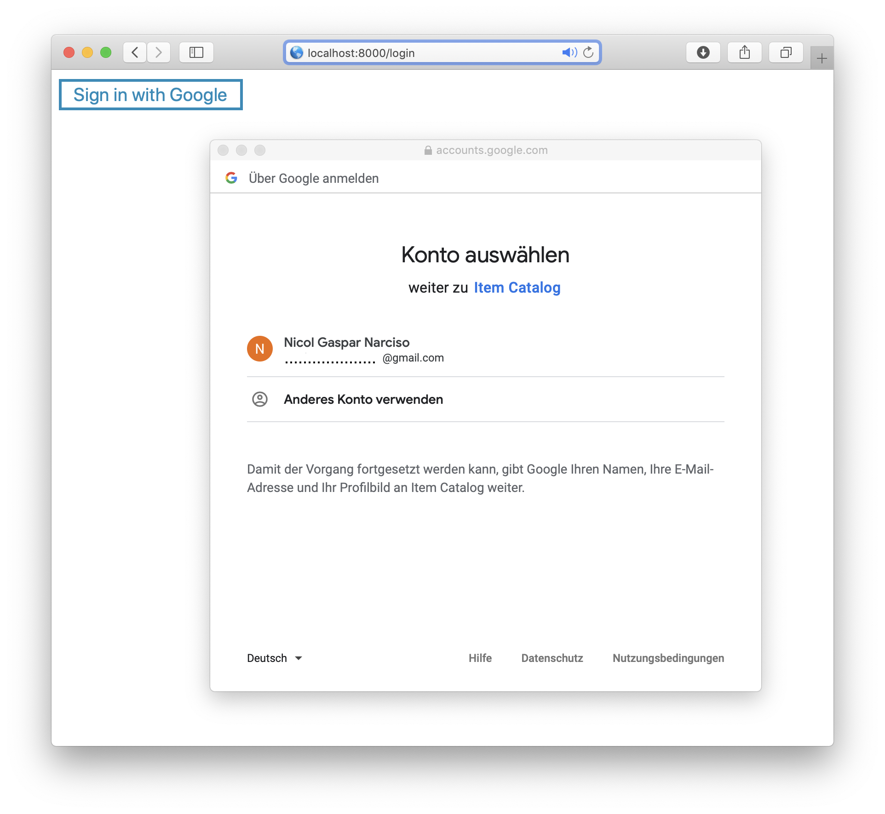
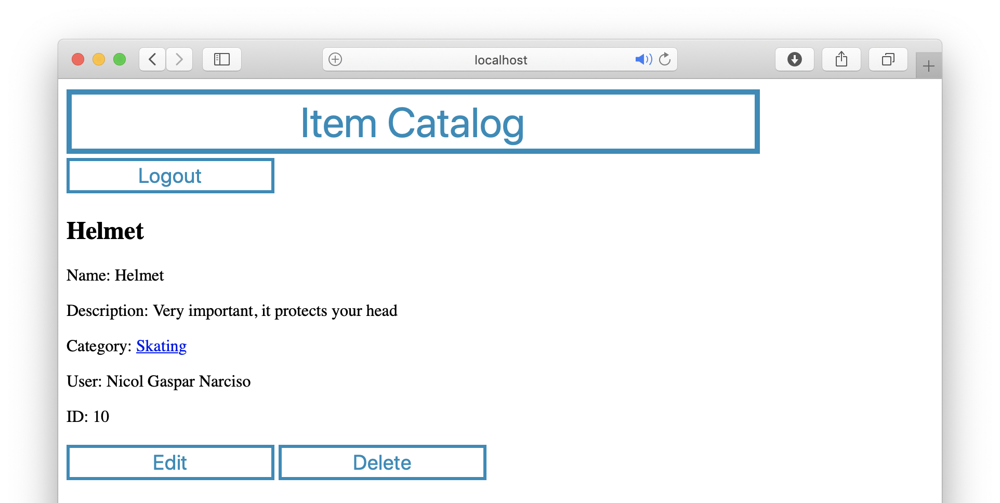
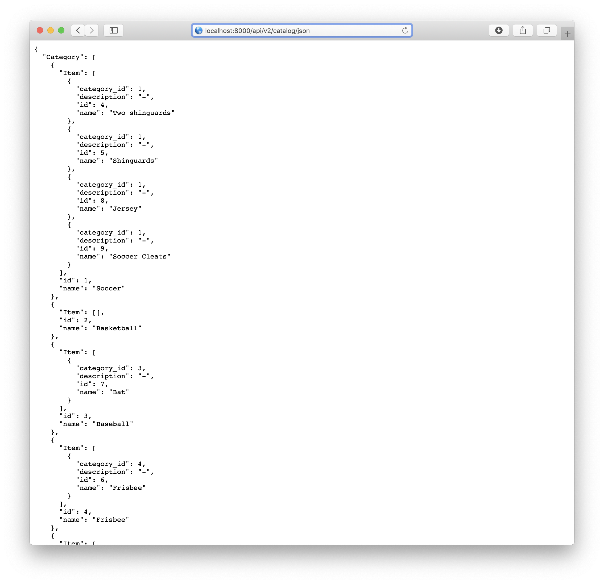
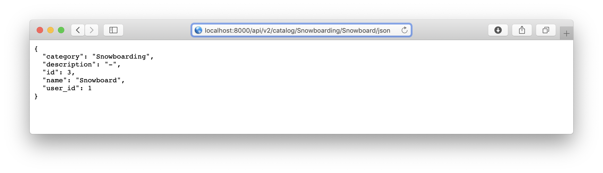

# Item Catalog

The Item Catalog is a web application that provides a list of items within a variety of categories, as well as provide a user registration and third party authentication system. Authenticated users have the ability to CREATE, READ, UPDATE and DELETE (CRUD) their own items.

## Getting Started

These instructions will get you a copy of the project up and running on your local machine for development and testing purposes.

### Getting started with vagrant
1. Download and install [Vagrant](https://www.vagrantup.com/downloads.html).
2. Download and install [Virtual Box](https://www.virtualbox.org/wiki/Downloads).
3. Clone [Vagrant configuration](https://github.com/udacity/fullstack-nanodegree-vm).
4. Clone the content of this repository to your vagrant folder
5. Start your console from the vagrant folder
6. Run vagrant: ```$ vagrant up ```
7. Login to vagrant on the virtual machine: ```$ vagrant ssh```
8. Navigate to the shared folder on the virtual machine: ```$ cd /vagrant```
9. Launch application: ```$ python project.py```
10. Open the web application on the client browser: ```http://localhost:8000```

### Getting started on Mac without vagrant
1. Install Python 3.7 or later: ```$ brew install python```
2. Install PostgreSQL server: ```$ brew install postgresql```
3. Start PostgreSQL server as a permanent service: ```$ brew services start postgresql```
4. Install SQLAlchemy database toolkit: ```$ pip install sqlalchemy```
5. Install Flask web development framework: ```$ pip install flask```
6. Install OAuth2 client for Google sign in: ```$ pip install oauth2client```
7. Install Httplib2 to access HTTP Layer: ```$ pip install httplib2```
8. Launch application: ```$ python project.py```
9. Open the web application on your browser: ```http://localhost:8000```

### Set up new OAuth2 client ID and secret
1. Login to your google account: https://console.developers.google.com/apis/credentials
2. Navigate to Credentials
3. Select Create Credentials Credential 
```
Credential type: "OAuth client ID" 
```
```
Application type: "Web application"
```
```
Name: "Item Catalog"
```
```
Restrictions.Authorized JavaScript origins: "http://localhost:8000"
```
```
Restrictions.Authorized redirect URIs:  "http://localhost:8000/oauth2callback"
                                        "http://localhost:8000/login"
                                        "http://localhost:8000/gconnect"
```
4. Save
5. Download Client Secret JSON-File and save it as "client_secret_apps.googleusercontent.com.json" to the root prject folder.
6. Navigate to OAuth consent screen
7. Configure OAuth consent screen
```
Application name: "Item Catalog" 
```
8. Save

 

## Project


## HTML Endpoints

### Overview



### Login with Google


### Create


### Read


### Update


### Delete

                                                     
## JSON Endpoints

### Read complete catalog as json
```
http://localhost:8000/api/v2/catalog/<string:category_name>/<string:item_name>/json
```


### Read a specific catalog item as json
```
http://localhost:8000/api/v2/catalog/json
```


